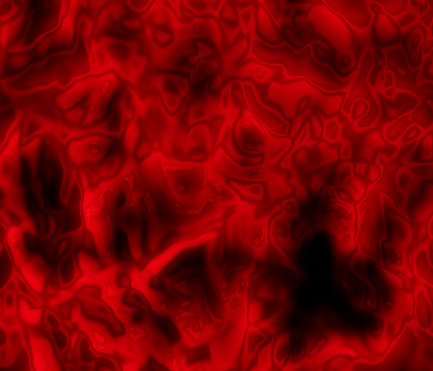

<div align="center">
    <h1>Project-05</h1>
    <p align="center">
        Three JS Liquid Shader
    </p>
    <p align="center">
      Project from Three.js Journey shaders lessons https://threejs-journey.com/lessons/raging-sea-shading-shaders
    </p>
</div>

## Preview



## Setup

Download [Node.js](https://nodejs.org/en/download/).
Run this followed commands:

```bash
# Install dependencies (only the first time)
npm install

# Run the local server at localhost:8080
npm run dev

# Build for production in the dist/ directory
npm run build
```
